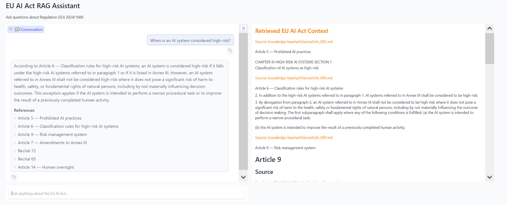

# EU AI Act RAG

A retrieval-augmented generation (RAG) system for answering questions about
Regulation (EU) 2024/1689, the European Union Artificial Intelligence Act.

The project uses the official text of the EU AI Act, structured into Articles,
Recitals, and Annexes, as its knowledge base.

## Architecture

User question
→ Hugging Face MiniLM embeddings
→ Chroma vector database
→ relevant EU AI Act chunks
→ OpenAI language model
→ answer with legal-source references

## Usage

You can ask natural-language questions about the EU AI Act, for example:

- What AI practices are prohibited?
- When does the EU AI Act apply?
- What are the obligations of providers of high-risk AI systems?

For precise provision lookup, you can also query a specific legal provision directly:

- `Article 6?`
- `Article 50?`
- `Annex I?`
- `Recital 47?`

## Demo

The Gradio interface provides two complementary views of the RAG pipeline:

- **Conversation** — displays the generated answer together with the EU AI Act
  provisions retrieved as legal references.
- **Retrieved EU AI Act Context** — displays the source chunks retrieved from
  the Chroma vector database and supplied to the language model as context.

This makes the retrieval process transparent and allows users to inspect the
legal sources underlying the generated answer.



## Running the Application

Install the project dependencies from the project root:

```powershell
uv sync
```

Move to the application directory:

```powershell
cd week5
```

Start the Gradio application:

```powershell
python app.py
```

The application will start on a local Gradio URL, for example:

```text
http://127.0.0.1:7860
```

If that port is already in use, Gradio may automatically select another local
port, such as `7861`.

The application uses the shared RAG implementation in
`week5/implementation/answer.py`, ensuring that the interactive application and
the evaluation pipeline use the same retrieval and answer-generation logic.

## Knowledge Base

The corpus contains:

- 113 Articles
- 180 Recitals
- 13 Annexes

The source text is derived from Regulation (EU) 2024/1689.

## Evaluation

The project includes a legal-domain evaluation framework covering:

- Mean Reciprocal Rank (MRR)
- nDCG
- keyword coverage
- answer accuracy
- completeness
- relevance
- legal-source accuracy

## Current Research Focus

The baseline dense-retrieval system works well for some direct legal questions,
such as application dates under Article 113.

More difficult questions involving long provisions distributed across multiple
chunks, such as Article 5 on prohibited AI practices, expose limitations of
flat dense retrieval.

Planned improvements include provision-aware retrieval, hybrid retrieval,
reranking, and legal structure-aware chunking.

## Disclaimer

This project is for research and educational purposes only and does not provide
legal advice.