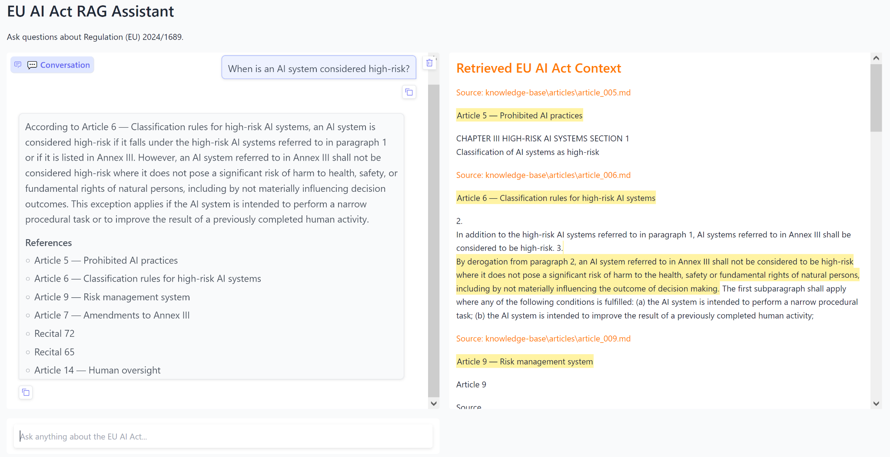

# EU AI Act RAG

A retrieval-augmented generation (RAG) system for answering questions about
Regulation (EU) 2024/1689, the European Union Artificial Intelligence Act.

The project uses the official text of the EU AI Act, structured into Articles, Recitals, and Annexes, as its knowledge base.

## Architecture

```text
User question
      │
      ▼
EU AI Act scope check
      │
      ├── Outside scope ──► Reject question
      │
      ▼
Hugging Face MiniLM embeddings
      │
      ▼
Chroma vector database
      │
      ▼
Relevant EU AI Act chunks
      │
      ├──────────────► Evidence highlighting
      │                    │
      ▼                    ▼
OpenAI language model   Retrieved context viewer
      │
      ▼
Answer with legal-source references
```

The application can run locally or inside a Docker container. Docker provides a
reproducible runtime environment for the Gradio interface and RAG pipeline, while
the OpenAI API key is supplied separately at runtime.

## Usage

You can ask natural-language questions about the EU AI Act, for example:

- What AI practices are prohibited?
- When does the EU AI Act apply?
- What are the obligations of providers of high-risk AI systems?

For precise provision lookup, you can also query a specific legal provision directly:

- `Article 6?`
- `Article 50?`
- `Annex I?`
- `Recital 47?`

### Scope restriction

The application is intentionally restricted to questions about the EU AI Act.
Clearly unrelated questions are rejected before the normal RAG workflow.

For example:

- `What duties does a product manufacturer have?` → processed by the EU AI Act RAG.
- `What is the capital of Japan?` → rejected as outside the supported scope.

This prevents the application from functioning as an unrestricted general-purpose
chatbot and keeps retrieval and generation focused on the legal knowledge base.

## Demo

The Gradio interface provides two complementary views of the RAG pipeline:

- **Conversation** — displays the generated answer together with the EU AI Act provisions retrieved as legal references.
- **Retrieved EU AI Act Context** — displays the source chunks retrieved from the Chroma vector database and supplied to the language model as context.

The context viewer also highlights answer-relevant sentences within the retrieved legal text. This provides an evidence-location aid that helps users identify passages that are particularly relevant to the generated answer while preserving the surrounding Article, Recital, or Annex context.



The highlighted passages are selected automatically by comparing the generated answer with the retrieved legal context. Highlighting is intended to improve evidence traceability and should not be interpreted as exact claim-to-sentence legal attribution.

## Evidence Highlighting

The application includes an evidence-highlighting layer for the retrieved EU AI Act context.

After an answer is generated, the system compares the answer with sentences in the retrieved legal passages and identifies the strongest overlapping evidence. Selected sentences are highlighted directly in the right-hand context viewer.

This approach preserves the surrounding legal structure while making relevant passages easier to locate. Because the EU AI Act corpus is structured into Articles, Recitals, and Annexes, evidence can be displayed directly within the retrieved legal text.

### Highlighting limitations

The highlighting is intended as an **evidence-location aid**, rather than an exact claim-to-sentence attribution system. Retrieved chunks may contain surrounding context in addition to the passage directly supporting the generated answer. **Relevant supporting evidence may therefore occur immediately before or after a highlighted passage in the retrieved legal context.**

The highlighted passages are selected automatically based on textual overlap between the generated answer and retrieved legal text. A highlighted sentence may therefore provide relevant context without independently supporting every part of the generated answer.

The original EU AI Act provision remains the authoritative legal source.

## Running the Application

Install the project dependencies from the project root:

```powershell
uv sync
```

Move to the application directory:

```powershell
cd week5
```

Start the Gradio application:

```powershell
python app.py
```

The application will start on a local Gradio URL, for example:

```text
http://127.0.0.1:7860
```

If that port is already in use, Gradio may automatically select another local
port, such as `7861`.

The application uses the shared RAG implementation in
`week5/implementation/answer.py`, ensuring that the interactive application and the evaluation pipeline use the same retrieval and answer-generation logic.

## Docker

The application can also be run in a Docker container, providing a reproducible
environment for the Gradio interface, retrieval pipeline, and evidence-highlighting
functionality.

Build the Docker image from the project root:

```powershell
docker build -t eu-ai-act-rag .
```

Create a local `.env` file containing your OpenAI API key:

```text
OPENAI_API_KEY=your_api_key
```

Run the container:

```powershell
docker run --rm -p 7860:7860 --env-file .env eu-ai-act-rag
```

Then open:

```text
http://127.0.0.1:7860
```

The `.env` file is excluded from version control. The OpenAI API key is supplied
at runtime and is not stored in the Docker image.

## Knowledge Base

The corpus contains:

- 113 Articles
- 180 Recitals
- 13 Annexes

The source text is derived from Regulation (EU) 2024/1689.

## Evaluation

The project includes a legal-domain evaluation framework covering:

- Mean Reciprocal Rank (MRR)
- nDCG
- keyword coverage
- answer accuracy
- completeness
- relevance
- legal-source accuracy

## Current Research Focus

The baseline dense-retrieval system works well for some direct legal questions, such as application dates under Article 113.

More difficult questions involving long provisions distributed across multiple chunks, such as Article 5 on prohibited AI practices, expose limitations of flat dense retrieval.

The current system also includes answer-relevant evidence highlighting in the retrieved legal context. This improves source traceability by helping users locate passages related to the generated answer while retaining the surrounding legal provision.

Planned retrieval improvements include provision-aware retrieval, hybrid retrieval, reranking, and legal structure-aware chunking. Future evidence-traceability work could include claim-level attribution and more precise semantic evidence matching.

## Acknowledgments

This project was developed in part from the RAG implementation introduced in
[Ed Donner's LLM Engineering repository](https://github.com/ed-donner/llm_engineering).

The original course repository is licensed under the MIT License. This project adapts and extends that implementation for EU AI Act legal retrieval, including a structured legal knowledge base, provision-aware metadata, direct legal provision lookup, legal-source references, EU AI Act-specific evaluation, and a customized Gradio interface.

See [THIRD_PARTY_LICENSES.md](THIRD_PARTY_LICENSES.md) for the applicable
third-party license notice.

## Disclaimer

This project is for research and educational purposes only and does not provide legal advice.
